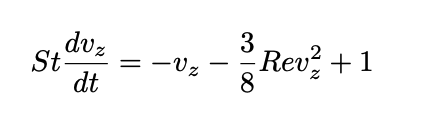
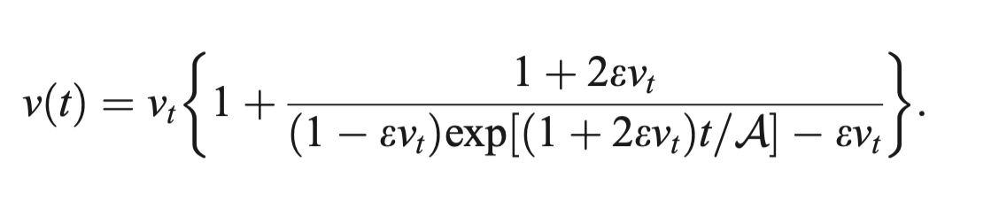
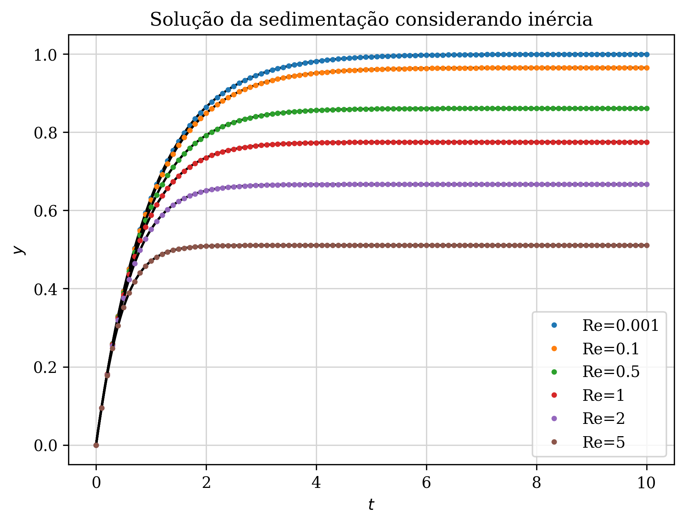
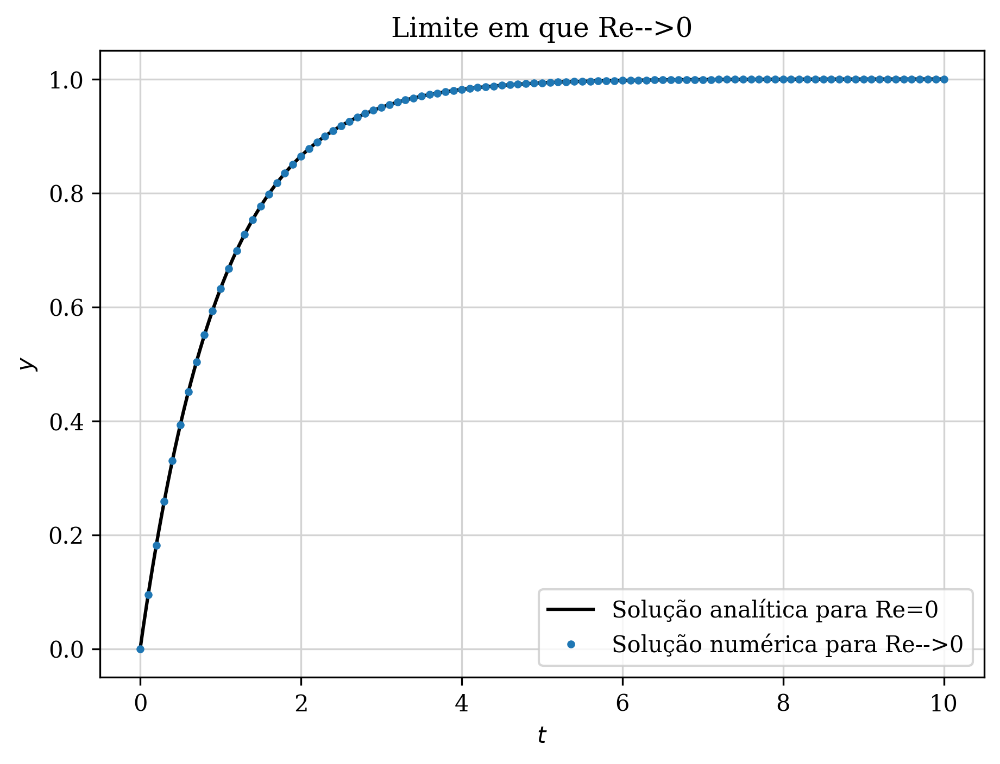

# Sedimentação de uma esfera em um fluido viscoso

Para contextualização do problema, leia o arquivo Contexto.pdf, que contêm o problema proposto.

Resolvendo a EDO aplicando o método de Runge Kutta de quarta ordem, podemos comparar com a solução analítica para diferentes números de Stokes. Os resultados são mostrados na figura abaixo:

Aqui vemos que a solução numérica do método de Runge-Kutta possui uma altíssima precisão em comparação à solução analítica. Também observa-se que quando aumenta-se o número de Stokes, o tempo para a esfera atingir a velocidade terminal aumenta, mas a magnitude da velocidade terminal não muda, como esperado. 

Agora vamos analisar os efeitos do passo de tempo aplicado no método de Runge-kutta na solução numérica do problema. Para isso, vamos considerar um número de Stokes fixo St=5 e um tempo final de 20 segundos. Na imagem abaixo, vemos os resultados numéricos para diferentes passos de tempo h. Observa-se que com o aumento do passo de tempo, a precisão do método cai consideravelmente. Contudo, devido a robustez o método de Runge-Kutta, um passo de tempo de 0,5s já é suficiente para descrever com precisão este problema de sedimentação. 

Agora passamos para a segunda parte do problema, em que consideramos os termos inerciais na sedimentação. O primeiro passo é fazer a adimensionalização da equação proposta, que resulta na seguinte equação adimensionalizada: 

Vemos que o número de Reynolds aparece na equação, de modo que os termos inerciais passam a ter um efeito, dependendo deste parâmetro adimensional. 
Em sala foi apresentado um artigo que traz uma solução analítica para este problema de sedimentação com efeitos inerciais, que que a solução analítica é dada pela equação

Para analisar este caso, vamos considerar um número de Stokes fixo St=1, para estudar apenas a influência do número de Reynolds na sedimentação da esfera. Resolvendo a EDO pelo método de Runge Kutta e comparando com a solução analítica, temos os seguintes resultados:

Observa-se que para Reynolds maiores, a velocidade terminal da esfera diminui. Isso ocorre pois com o aumento do número de Reynolds, o termo de inérica ganha maior relevância, de modo que a energia dissipada é maior e a velocidade da esfera diminui, como esperado. 

Finalmente, vamos comparar as soluções no limite assintótico em que Re->0. Neste limite, podemos comparar a solução numérica do segundo caso, considerando Re=0.001, e a solução analítica do primeiro caso, em que desconsidera-se totalmente os termos inerciais. Nesse caso, vemos no gráfico abaixo que as duas soluções convergem no limite em que Re->0

