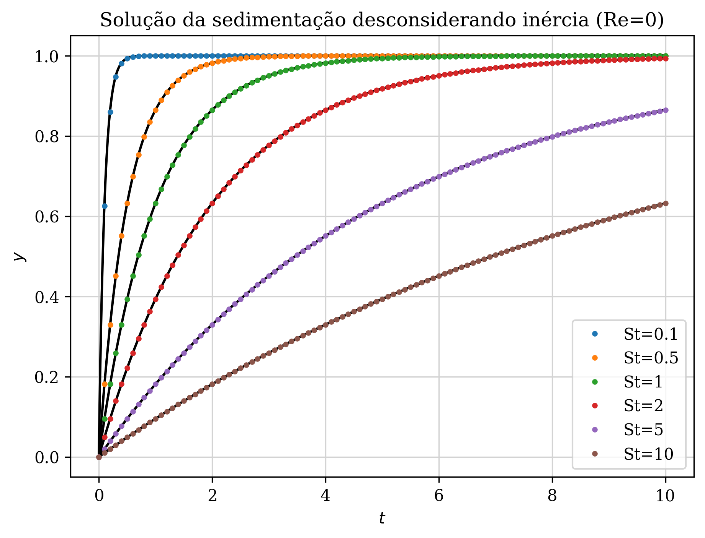

# Sedimentação de uma esfera em um fluido viscoso

Para contextualização do problema, leia o arquivo Contexto.pdf, que contêm o problema proposto.

Resolvendo a EDO aplicando o método de Runge Kutta de quarta ordem, podemos comparar com a solução analítica para diferentes números de Stokes. Os resultados são mostrados na figura abaixo:

Aqui vemos que a solução numérica do método de Runge-Kutta possui uma altíssima precisão em comparação à solução analítica. Também observa-se que quando aumenta-se o número de Stokes, o tempo para a esfera atingir a velocidade terminal aumenta, mas a magnitude da velocidade terminal não muda, como esperado. 

Agora vamos analisar os efeitos do passo de tempo aplicado no método de Runge-kutta na solução numérica do problema. Para isso, vamos considerar um número de Stokes fixo St=5 e um tempo final de 20 segundos. Na imagem abaixo, vemos os resultados numéricos para diferentes passos de tempo h. Observa-se que com o aumento do passo de tempo, a precisão do método cai consideravelmente. Contudo, devido a robustez o método de Runge-Kutta, um passo de tempo de 0,5s já é suficiente para descrever com precisão este problema de sedimentação. 

Agora passamos para a segunda parte do problema, em que consideramos os termos inerciais na sedimentação. O primeiro passo é fazer a adimensionalização da equação proposta, que resulta na seguinte equação adimensionalizada: 

## Example result
Here is one of the results:

