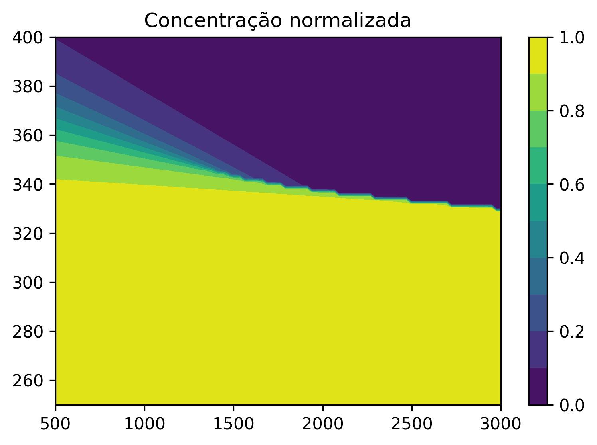
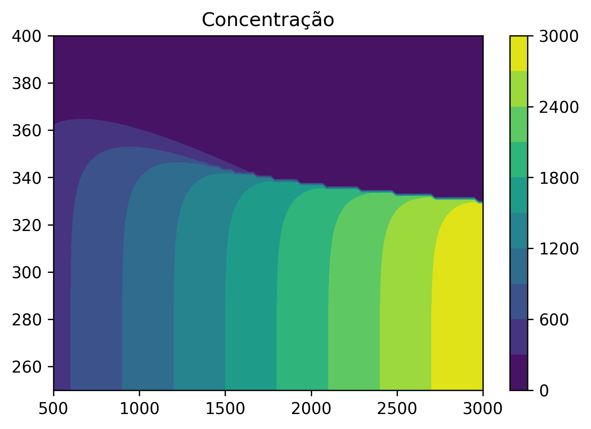
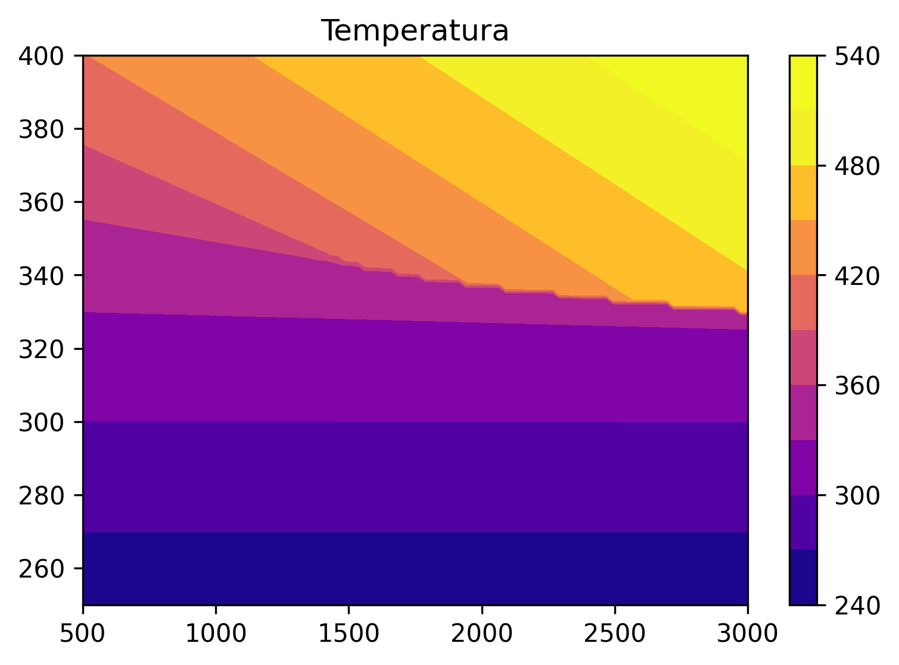

  # Problema da concentração e temperatura do reator em função das condições iniciais

O enunciado do problema segue no arquivo encontro4.pdf 
Neste problema, precisamos resolver a concentração e temperatura final de um reator, em função das concentrações e temperaturas iniciais.
O programa inicialmente calcula as concentrações finais em função das condições determinadas no enunciado. Em seguida, testa três condições iniciais distintas, que levam a três soluções diferentes. 

Por fim, faz uma varredura de concentrações e temperaturas iniciais e plota os resultados em um gráfico de contorno colorido, para análise dos resultados. Os gráficos seguem abaixo. 

O esperado era que se formassem três regiões nos gráficos de concentração e 
temperatura. Essa visualização fica mais fácil a partir do gráfico de 
concentração normalizada, que é calculada dividindo a concentração final pela
concentração inicial. Assim, quando a concentração normalizada é 1, nenhuma 
reação ocorreu, e quando ela é zero, a concentração de saída é muito pequena
em relação a concentração de entrada, indicando que a maior parte da espécie A
reagiu. No gráfico de concentração normalizada observa-se três regiões, uma em
que a concentração normalizada é sempre 1, uma em que é sempre zero, e uma 
terceira região de transição, em que apenas uma parcela da espécie A reagiu no
reator. 

Esse mesmo efeito pode ser observado no gráfico de temperatura, em que quando
a temperatura de entrada é muito pequena, a temperatura de saída se mantêm a 
mesma. Para maiores temperaturas de entrada, observa-se um aumento da temperatura
de saída, indicando que a reação está ocorrendo e liberando calor. Tambem pode-se
observar que para maiores temperaturas de entrada, a temperatura de saída
depende da concentração, de modo que para maiores concentrações iniciais 
observa-se uma maior temperatura de saída. 
