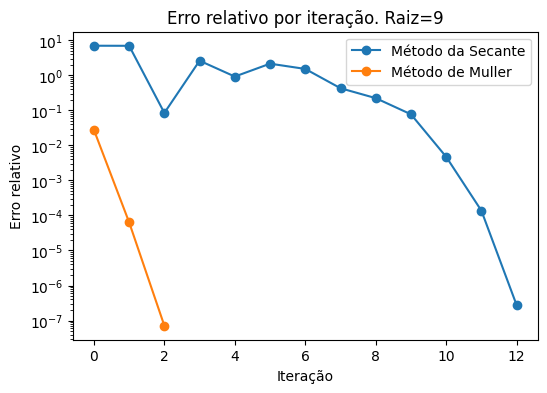

# Comparação entre os algoritmos de Muller e Secante

O enunciado deste problema segue no arquivo Enunciado.png

Neste problema, precisamos encontrar as raízes de um polinômio que já conhecemos para comparar a convergência dos métodos de muller e da secante.
Assim, o programa parte de uma sequencia de chutes iniciais de raízes próximas as raízes conhecidas, para comparar de forma justa os dois métodos.

O programa entao gera um gráfico de convergência de cada uma das raízes, para comparar a velocidade dos métodos. Em todos os casos o método de Muller converge mais rapidamente

Abaixo segue um dos exemplos de convergência, para a raíz=9 do polinomio 

