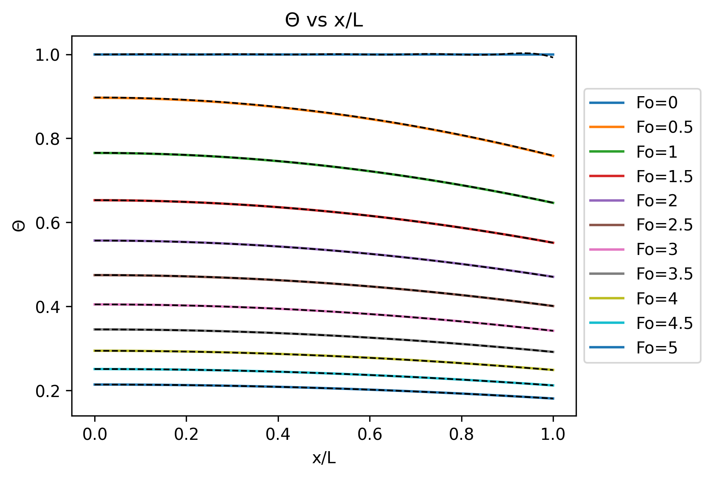
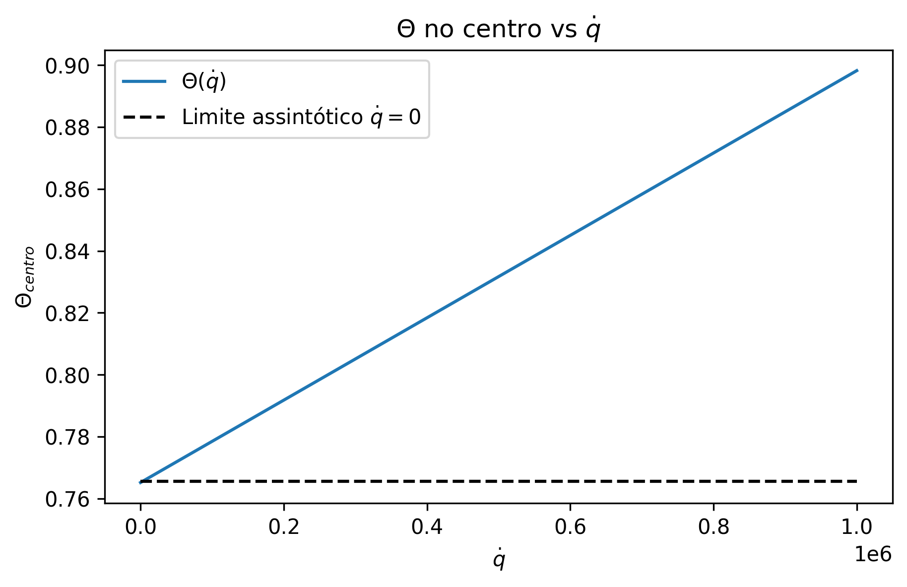
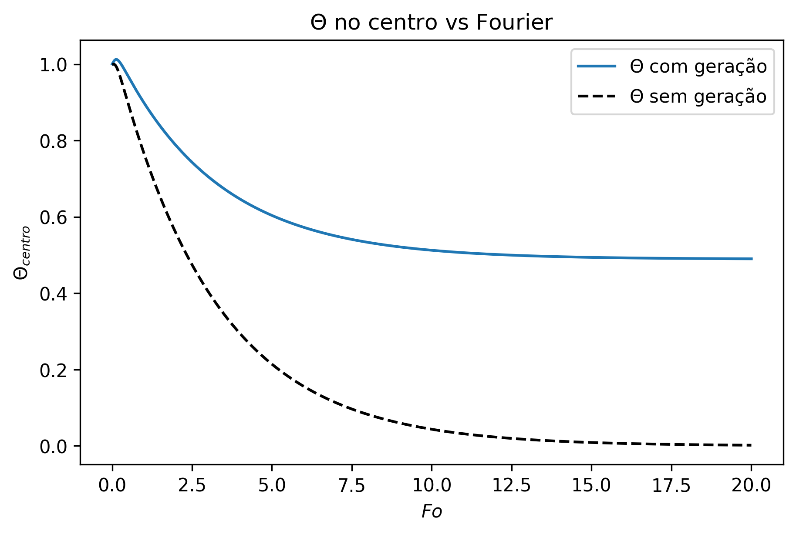

# Usando o algorítmo de Thomas para resolver problemas de matrizes de banda

O enunciado deste problema segue no final do arquivo Encontro7.pdf

Neste problema, precisamos resolver um problema de distribuição de temperatura em um compustível sólido de um reator nuclear. Este problema, como mostrado no enunciado,
se resume a um sistema linear em que a matriz A é uma matriz de banda de largura 3. Podemos então aplicar o algorítmo de Thomas para solucionar este problema. São analisadas
duas situações, primeiramente sem geração interna, com solução analítica, e em seguida com geração interna. 

O programa gera três gráficos para representar os resultados do problema. O primeiro é uma comparação entre os resultados numéricos e analíticos do problema sem geração interna,
para diferentes números de Fourier. 

Em seguida, para o caso com geração interna, em que não existe uma solução analítica, é feita uma análise do limite em que q->0, para ver se a solução com geração converge com a analítica
neste limite, em que os resultados mostram que convergem. 

Por fim, o terceiro gráfico é uma comparação entre a temperatura no centro dos casos com e sem geração interna. 

