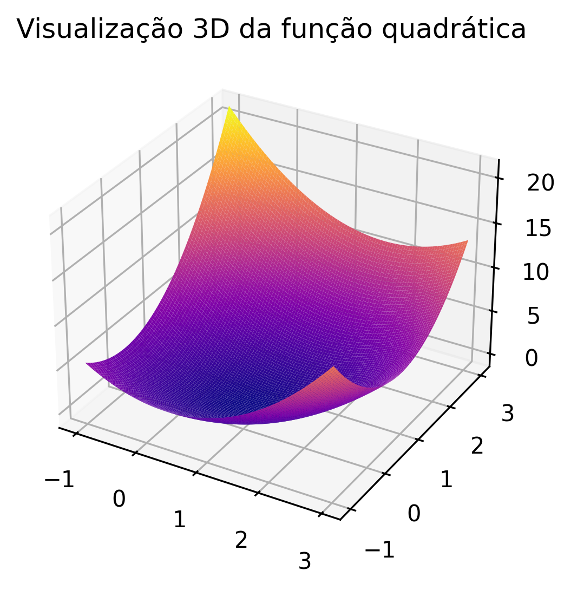
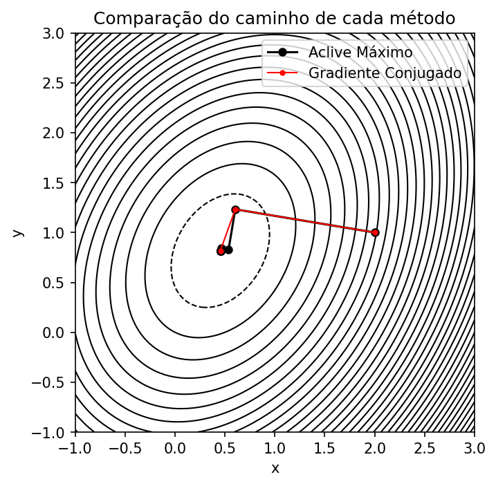
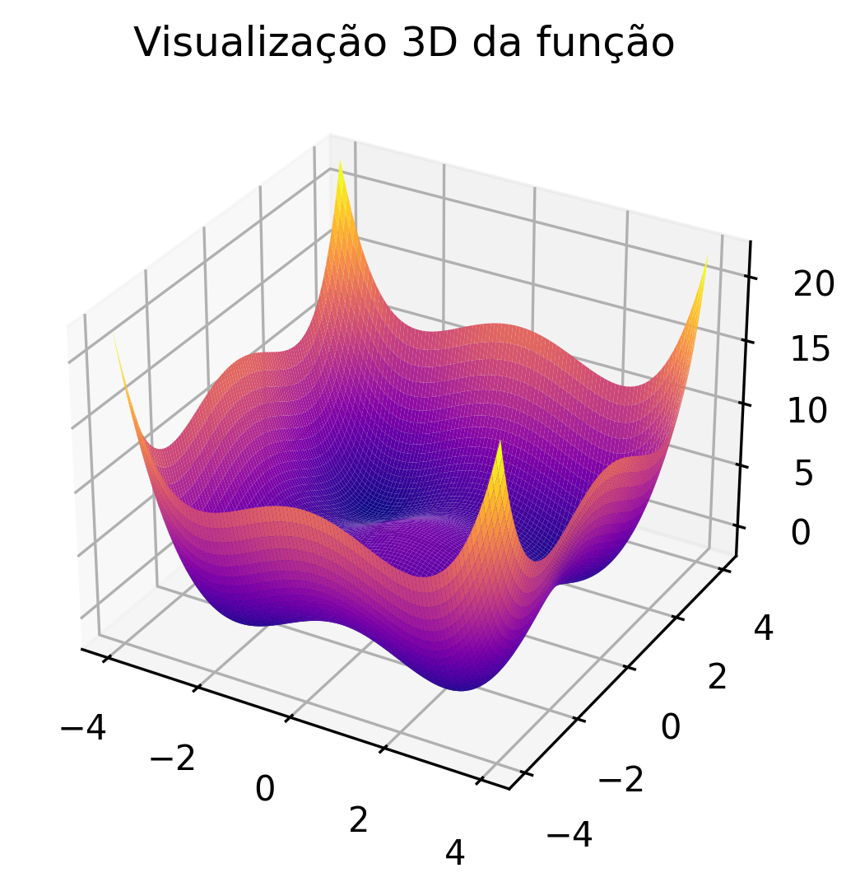
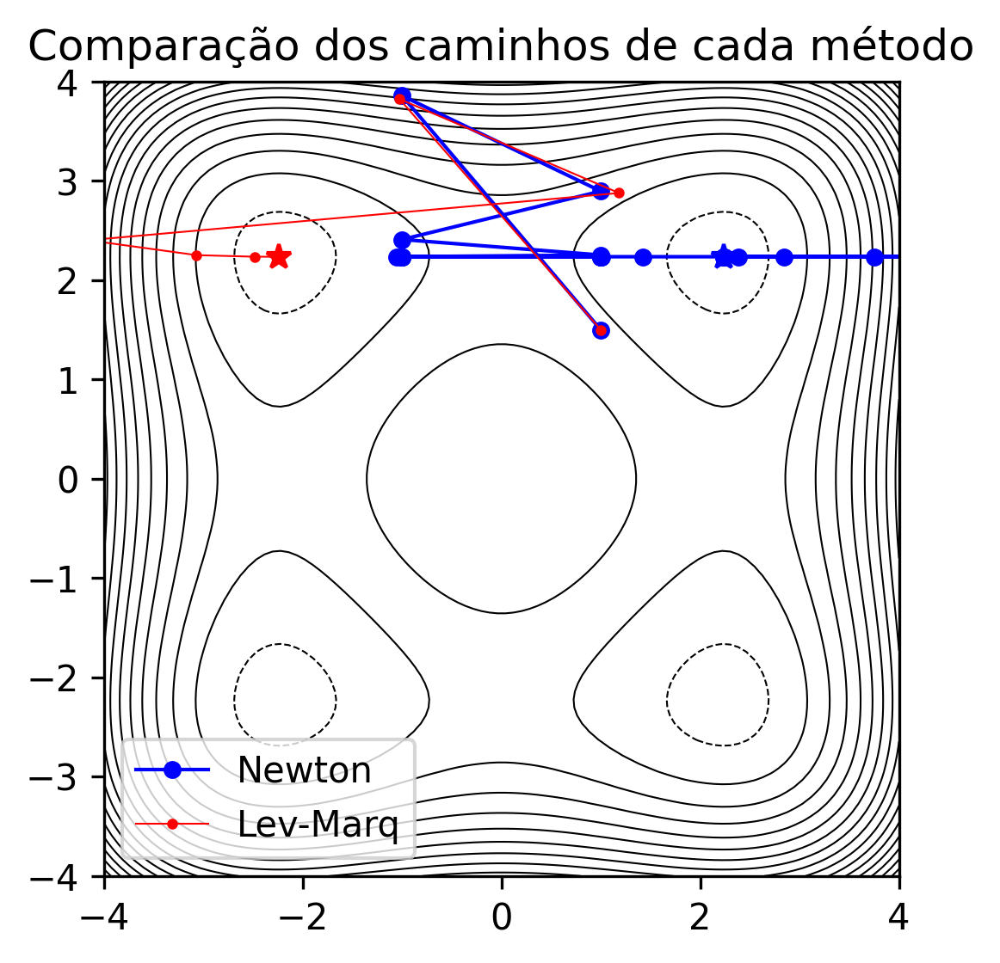

# Métodos para encontrar pontos críticos de funções

Baseado na aula 10 (PDF disponibilizado nesse ambiente), escreva um programa de computador que construa uma função f(x,y) contínua e monotônica e partindo de um ponto inicial encontra o ponto ótimo mais próximo. Esse programa deverá resolver o problema pelos seguintes métodos:

- Aclive máximo;

- Gradientes conjugados (método de Fletcher-Reeves);

- Método de Newton 

- Método de Levenberg-Marquardt

O seu programa deverá comparar o número de passos e o caminho percorrido por cada um dos métodos, partindo do mesmo ponto inicial.

Para este programa, foram utilizadas duas funções, uma para comparar o comportamento dos métodos do Aclive máximo e gradiente conjugados, 
e uma segunda função para comparar o método de Newton e o método de Levengerg-Marquardt. 

Para comparar os dois primeiros métodos foi utilizada uma função quadrática mais simples, em que o método dos gradientes conjugados chega no pico em muito menos iterações.

Para comparar os dois ultimos métodos, foi utilizada uma função mais complexa, com 4 pontos de máximo. Neste caso, partindo de um mesmo ponto, os dois métodos chegam a máximos diferentes,
com o método de Levenberg-Marquardt atingindo o máximo em menos iterações. 

