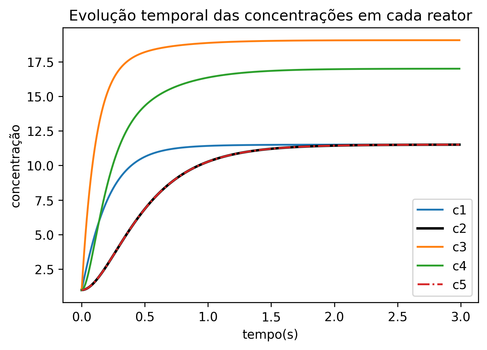

# Sistemas de EDOs Acopladas

O enunciado deste problema segue no arquivo Enunciado.png

Aqui, precisamos resolver um sistema de EDOs acopladas, utilizando o método de Runge-Kutta de quarta ordem clássico. 

 Para resolver o problema, é necessário assumir alguns valores iniciais de concentração
 e volume dos reatores, que não foram especificados. 
 Vamos então, por motivos de simplificação, assumir que o volume dos reatores é
 1 unidade de volume, e a concentração inicial de cada reator é igual a 1
 Como possuimos um sistema de equações acopladas, para resolver cada passo de
 tempo a partir de um método de Runge-Kutta de 4a ordem, precisamos calcular
 os fatores do método para cada equação simultaneamente, ou seja, primeiro
 calculamos todos os k1s, depois todos os k2s, e assim por diante, para obter
 o próximo passo de tempo para todas as equações simultaneamente. 

 O programa então resolve este sistema até atingir um regime permanente, que ocorrem aproximadamente em 3s

 Os resultados da evolução temporal das concentrações são apresentadas no gráfico abaixo

 
